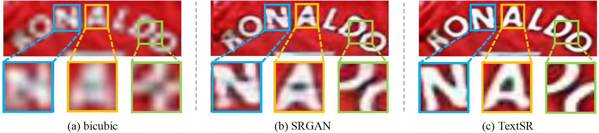
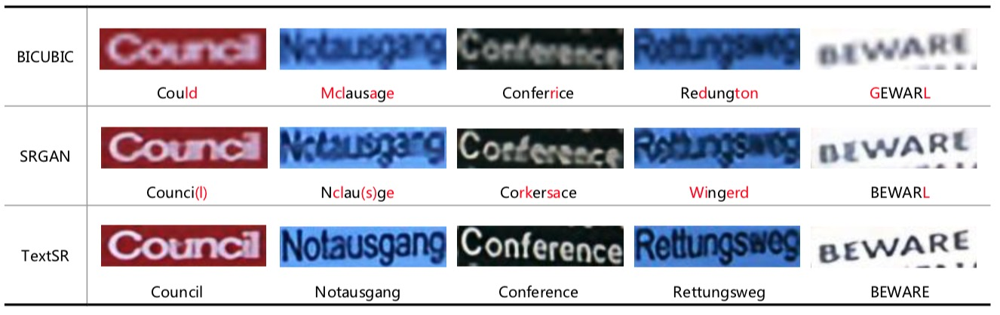

# TextSR-pytorch(code coming soon)

## introduction

* This project is a pytorch inplementation of the scene text picture super-resolution algorithm [TextSR](https://arxiv.org/abs/1909.07113).   TextSR is an end-to-end network aimed at restoring the low-resolution scene text images, in which the results of the text recognition network can feed back to guide the training of the super-resolution network. Under the guidance of the text recognition network, the super-resolution network would focus on refining the text region, and thus generate clear, sharp and identifiable text images.

* We mainly compare our method with SOTA super-resolution  method SRGAN.

* Demo: scene text image 'RONALDO'., for more details, please refer to [TextSR](https://arxiv.org/abs/1909.07113).



Other positive cases:



## Datasets

* **Train:**

| Dataset       | Number | Note                                                         |
| ------------- | ------ | ------------------------------------------------------------ |
| SynthText     | 726W   | SynthText is the synthetic text dataset proposed in Synthetic Data for Text Localisation in Natural Images [download link](http://www.robots.ox.ac.uk/~vgg/data/scenetext/). It is proposed for text detection. We crop the words using the groundtruth word bounding boxes. |
| SynthText_hr: | 129W   | SynthText_hr are the images bigger than 128*32 in SynthText. |
| SynthText_HR: | 7W     | SynthText_HR are the images bigger than 256*64 in SynthText. |

You can crop the SynthText images by 

```
python3 utils/crop_800k.py --gt_path='./SynthText/gt.mat' --out_path='./'  --syntxt_path='./SynthText'
```

The output file **syntax_crop.odgt** contains the needed json information to create the LMDB file of SynthText.

* **Test:** 

Ic13, ic15, ic03, cute, svt, svtp, iiit5k

The 7 scene text recognition datasets can be found here: [[STR datasets]](https://github.com/chengzhanzhan/STR) (GitHub)

The LMDB of STR datasets can be downloaded here:

[[Google Drive]](https://drive.google.com/open?id=1vf_oJwk5V3pytMoblx6atSanxJSDccrt)   [[Baidu Netdisk]](https://pan.baidu.com/s/1yskh-1Nhob370wG8RY8EyQ)

* **Create LMDB:**

The LMDB files can be created by 

```go
python3 utils/create_lmdb.py
```

We have produced the codes to create LMDB files from **.txt **or **.odgt** file. You should change the details in the code.

## Models

* Our re-implemented aster model:

  [[Google Drive]]()    [[Baidu Netdisk]]()

* Our TextSR model (128*32, trained on SynthText_hr): 

  [[Google Drive]]()    [[Baidu Netdisk]]()

* SRGAN model (trained on ICDAR2013_train, ICDAR2015_train, SynthText_HR, 100 epochs): 

  [[Google Drive]]()    [[Baidu Netdisk]]()

## Prerequisites

- Pytorch 1.1.0
- Cuda 9.0
- Numpy 1.17.0
- 


## Training & testing & converting images

* **Training**

```go
python3 main.py --train_data_dir='./dataset/syn800k_hr' --val_data_dir='./dataset/ic15_1811' --width=128 --height=32 --epochs=10 --logs_dir='./logs_2019' 
```

* **Testing (lmdb file needed)**

Test with 

```go
sh test.sh
```

* **Converting images to bicubic & SRGAN & TextSR**

```go
python3 convert.py --image_path='./' --width=128 --height=32 --ds_scale=4
```


## Demonstration

* **Recognition accuracy inprovement on scene text recognition datasets:**

Generator trained and tested on SynthText_hr (129W) with the input size of **128*32**

| dataset         | ic15 | ic13 | ic03 | CUTE80 | svt  | svtp | IIIT5K |
| --------------- | ---- | ---- | ---- | ------ | ---- | ---- | ------ |
| ASTER           |      |      |      |        |      |      |        |
| **improvement** |      |      |      |        |      |      |        |
| ASTER(fintune)  | 78.0 |      |      |        |      |      |        |
| **improvement** |      |      |      |        |      |      |        |

Generator trained and tested on SynthText_HR (7W) with the input size of **256*64**

| dataset         | ic15 | ic13 | ic03 | CUTE80 | svt  | svtp | IIIT5K |
| --------------- | ---- | ---- | ---- | ------ | ---- | ---- | ------ |
| ASTER           | 77.5 | 88.2 |      |        |      |      |        |
| **improvement** | 78.5 | 88.4 |      |        |      |      |        |
| ASTER(fintune)  |      |      |      |        |      |      |        |
| **improvement** |      |      |      |        |      |      |        |

* **Restoration ability on low-resolution text image recognition:**


## Acknowledge

Our codes are based on SOTA recognition network [aster-pytorch], thanks very much.
